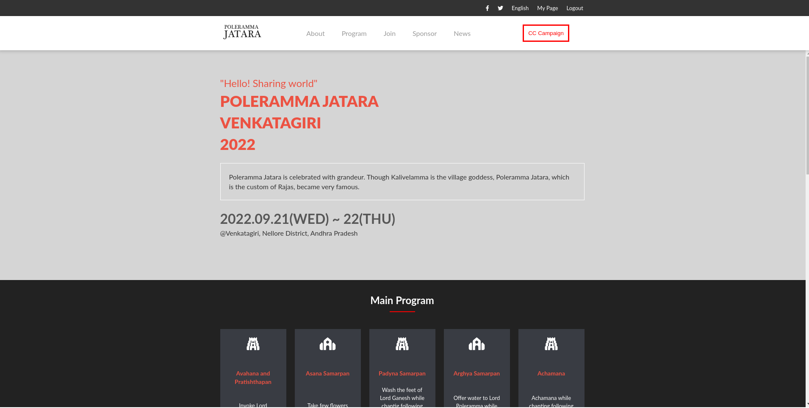
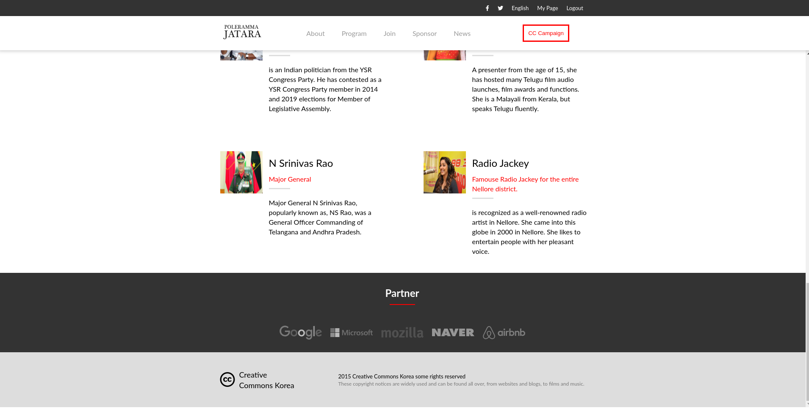
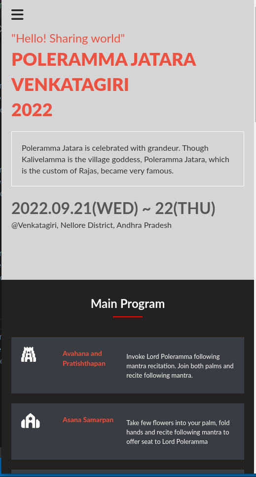
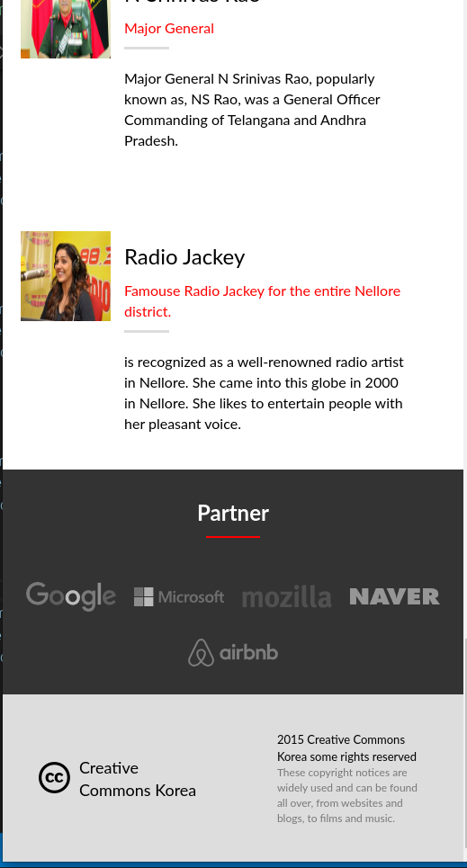

# First Capstone Project

> In this capstone project is to build a website based on an online website for a conference.

## Built With

- html, css , javascript

## Live Demo (if available)

[Live Demo Link](https://www.loom.com/share/67fa5845c0c7429791f35c33fd5dbdf4)

main page preview  

main page preview  

mobile page preview  

mobile page preview  

## Getting Started

**This is the first Capstone Project.**

To get a local copy up and running follow these simple example steps.

### Prerequisites

### Setup

### Install

### Usage

### Run tests

### Deployment

[Live Page](https://pratap-kumar.github.io/first-capstone-project/)

## Authors

PRATAP

- GitHub: [@PRATAP-KUMAR](https://github.com/PRATAP-KUMAR)
- Twitter: [@PRATAP_TWT](https://twitter.com/PRATAP_TWT)
- Linkedin: [@LinkedIn](https://www.linkedin.com/in/pratap-kumar-panabaka-755489236/)

## 🤝 Contributing

Contributions, issues, and feature requests are welcome!

Feel free to check the [issues page](../../issues/).

## Show your support

Give a ⭐️ if you like this project!

## Credits

- [Creative Commons license of the design](https://creativecommons.org/licenses/by-nc/4.0/)

## Acknowledgments

- Hat tip to anyone whose code was used
- Inspiration
- etc

## 📝 License

- This project is [MIT](./MIT.md) licensed.
- [Creative Commons license of the design](https://creativecommons.org/licenses/by-nc/4.0/)
